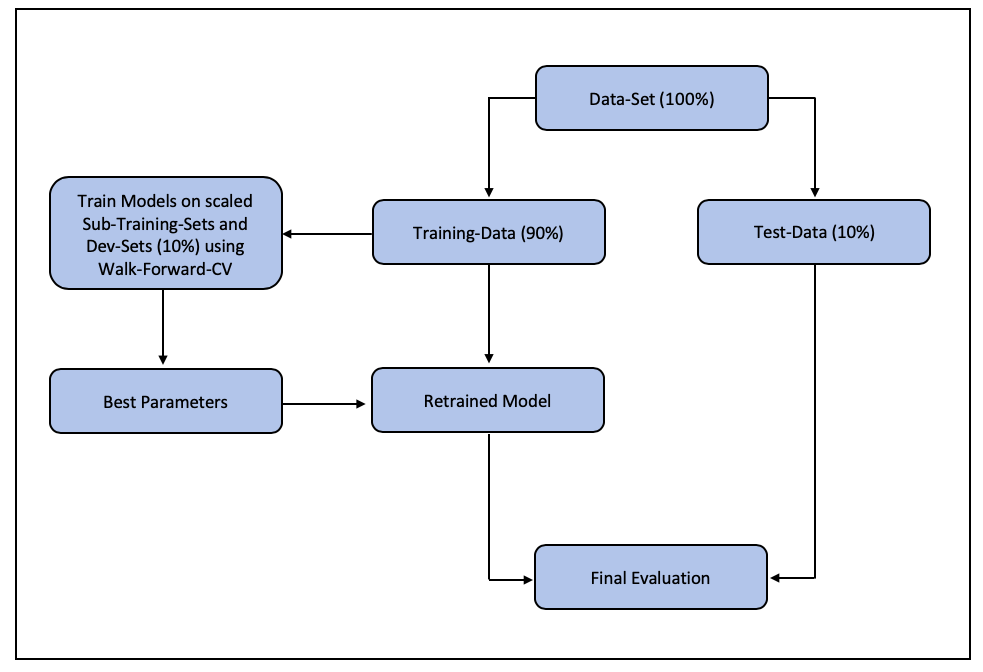
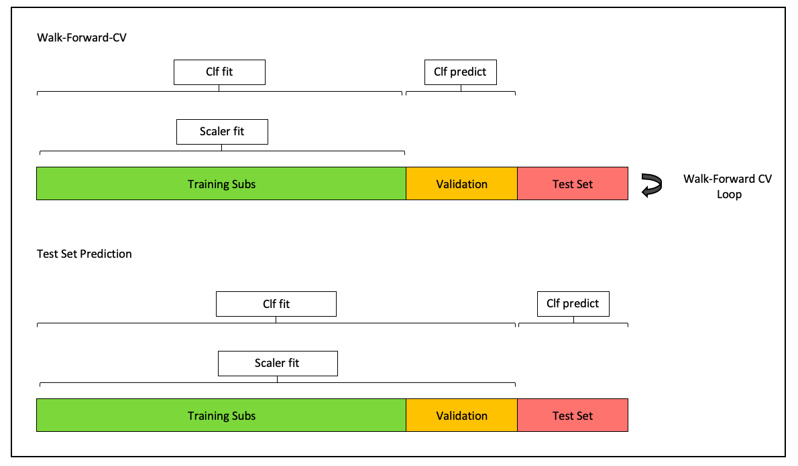
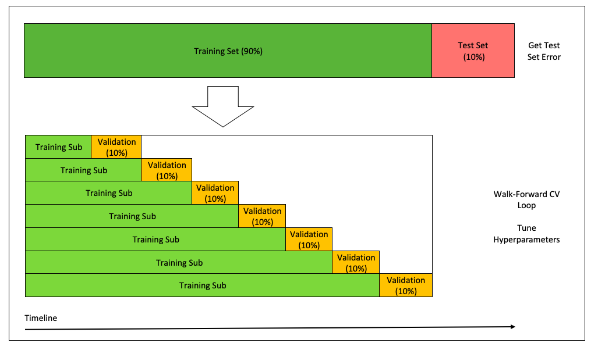

# Project: Predicting stock prices using a LSTM-Network

Introduction:
Artificial Intelligence is changing virtually every aspect of our lives. Today’s algorithms accomplish tasks that until recently only expert humans could perform. As it relates to finance, this is an exciting time to adopt a disruptive technology that will transform how investment decisions are made on a broad scale. Models that explain the returns of individual stocks generally use company and stock characteristics, e.g., the market prices of financial instruments and companies’ accounting data. These characteristics can also be used to predict expected stock returns out-of-sample. Most studies use simple linear models to form these predictions. An increasing body of academic literature documents that more sophisticated tools from the Machine Learning (ML) and Deep Learning (DL) repertoire, which allow for nonlinear predictor interactions, can improve the stock return forecasts. The main goal of this project is to investigate whether modern DL techniques can be utilized to more efficiently predict the movements of the stock market. Specifically, we train LSTM-networks with time series price-volume data and compare their out-of-sample return predictability with the performance of simple logistic regressions (our baseline models).

# Workflow

# Scaling

# Walk Forward

Methods: 
Long short-term memory (LSTM) recurrent neural network

Programming language: 
Python
